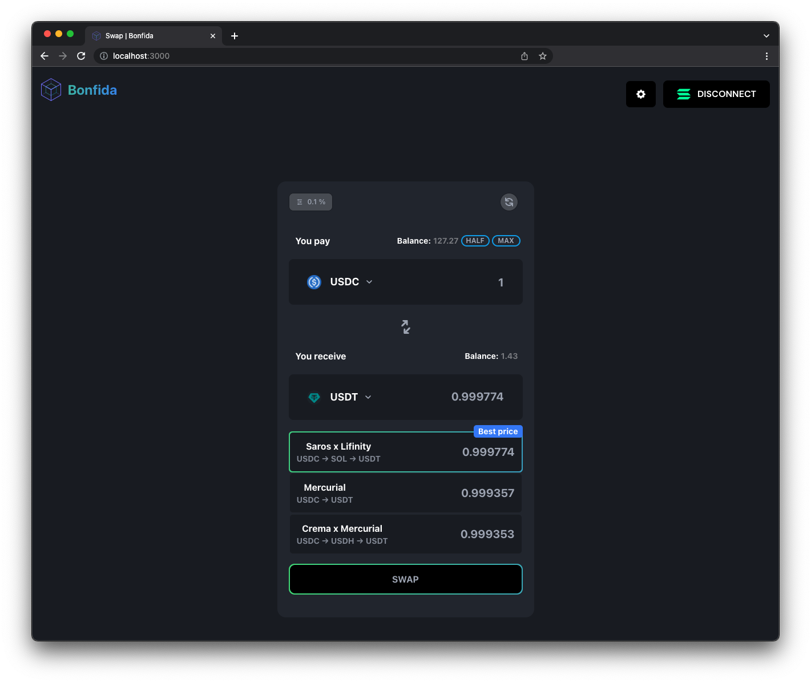

<h1 align="center">Stream Swap UI</h1>
<br />
<p align="center">

</p>
<p align="center">
<a href="https://twitter.com/stream_protocol">

</a>
</p>

<br />

<div align="center">


</div>

<br />

```
git clone https://github.com/streamdao/swap-ui
cd swap-ui
yarn
yarn dev
```

This swap UI is using [Jupiter](https://docs.jup.ag/how-does-jupiter-work) under the hood



<br />
<h2 align="center">Environment variables</h2>
<br />

[Environment variables](https://vitejs.dev/guide/env-and-mode.html) should be defined in `.env.local` and `.env.production`.

```
VITE_RPC= Your RPC URL
VITE_FEES= The address used to collect fees
VITE_FEES_BPS= The fees you want to charge on transaction
VITE_GEN_GO_TOKEN= The URL to fetch the auth token (might not be applicable)
GENERATE_SOURCEMAP=false
```
TODO

Stream Protocol RPC
Jupiter Aggregator, API implementation, token listing
STR token & Dex implementation
StreamPay Wallet integration
